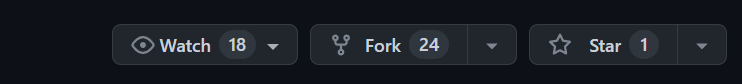

# Free Games Application

This is a simple application that provides a place to find free games to play!

The application provides a list of free games to play and some basic information about each game and a link to play the game. It has a few features. 

Feature 1: You can filter through a list of games by browser or PC or both.

Feature 2: You can search for a game. 

Feature 3: You can click on any game title and some basic information will be provided about the game and a link to where you can play it. 

Feature 4: You can add games to favorites to make it easier to locate your favorite games!

## Getting started 
You will need the json-server npm package installed to use feature 4. If you don't intend to use this feature you can skip this part. 

To install json-server, open your terminal and run: 
```
npm install -g json-server
```
If you're having trouble installing json-server npm package, here is the [link](https://www.npmjs.com/package/json-server) to their documentation. 

You must have node installed to run npm. Here is the [link](https://nodejs.org/en/download) to install it, if you haven't already. 

To start using this app, fork the repository to your account. 


Once that's done, open your terminal and cd into the 
folder you want to install the application in. 

Run the following code in your terminal: 
```
git clone [paste the url from the forked repo]
```
Here is where you can find the url to your forked repo:


Make sure you are using the url from the forked repo. In the url that you copied, it should have your github name in it. 

Now cd into the repo folder like so: 
 ```
 cd phase-1-final-project
 ```

 Once you're in the project run 
 ```
 json-server --watch db.json
 ```
Then open the index.html file in your browser and you should see a list of free games with some basic information and a link to start playing the game. Happy gaming!


