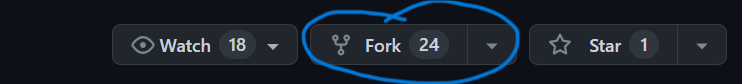

# Free Games Application

If you're a gamer like me, finding free games to play is one of the best ways to have some fun without spending to much.

This is a simple application that provides free games to play using the FreeToGame [API](https://www.freetogame.com/api-doc).

The application has a few features. 

Feature 1: You can filter through a list of games by browser, PC, or both.

Feature 2: You can search for a game. 


Feature 3: You can click on any game title and some basic information will be provided about the game and a link to where you can play it. 

Feature 4: You can add games to your favorites to make it easier to locate your favorite games next time!

## Getting started 
To get started, you will need the json-server npm package installed if you plan on using the 4th feature. If you don't intend to use it, you can skip this part. 

To install json-server, open your terminal and run: 
```
npm install -g json-server
```
If you're having trouble installing json-server npm package, here is the [link](https://www.npmjs.com/package/json-server) to their documentation. 

You must have node installed to run npm. Here is the [link](https://nodejs.org/en/download) to install it, if you haven't already. 

To start using this app, fork this repository to your account. 


Once that's done, open your terminal and cd into the 
folder you want to install the application in. 

Run the following code in your terminal: 
```
git clone [paste the url from the forked repo]
```
Here is where you can find the url to your forked repo:


Make sure you are using the url from the forked repo. In the url that you copied, it should have your github name in it. 

Now cd into the repo folder like so: 
 ```
 cd phase-1-final-project
 ```

 Once you're in the project run 
 ```
 json-server --watch db.json
 ```
Then open the index.html file in your browser and you should see a list of free games with some basic information and a link to start playing the game. Happy gaming!

## Contribution

If you like to contribute please don't hesitate to make a pull request with your cool ideas!

If you find any bugs create an issue and I'll be more than happy to look into. Thank You!